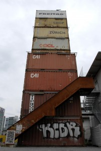
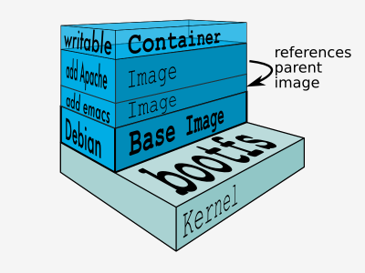

layout: true
background-position: center;
background-repeat: no-repeat;
background-size: contain;
background-image: url(images/elephant_and_whale.png)
class: bottom, center, inverse
---

# Dockerizing PHP Applications
## An introduction to Docker for PHP developers
### A talk by Rocco Palladino

???
- Who here has heard of Docker? knows basically what it is?
- Who uses it as part of dev workflow?
  + Not too many: Maybe after today you'll started
  + Lots: running in production?
- Using virtualized dev environment? (Virtualbox, Vagrant, maybe in combo with chef, puppet, ansible)
  + Not many: That's ok.
  + Lots: So docker is an alternative to that, maybe a complimentary one?
---
layout:true
class: middle
---

# About me

.float-right[]

## Web Applications Developer at the University of Chicago

## Working with PHP since 2006

## Web developer since 1999

<br><br>
[@rpalladino](https://twitter.com/rpalladino)<br>
[github.com/rpalladino](https://github.com/rpalladino)<br>
[rpalladino@gmail.com](mailto:rpalladino@gmail.com)

???

- So I'm a developer, not an ops guy
- I'll be approaching Docker mainly from that persepctive
- There's a whole other story about Docker from the infrastructure/ops side
- Quick adoption: embraced by both dev and ops, for different reasons
---

# Questions I'll answer in this talk

## What are containers and how do we use Docker to manage them?

## How do we use PHP with Docker?

## How does Docker compare with Vagrant, Chef, Puppet, Ansible, etc.?

???
- 1: i'll give an overview of the tech and how to get started using it
- 2: specifically, how do we get php apps to run in containers
- 3: vs. other tools you might be using in dev env
- focus today is on developer environment, how docker fits in it
- using docker in production: i won't talk about today
- if you want more about deployments, come to Madison PHP!
---
layout: true
class: middle
---
.float-right[]

# dockerize, v.
trans. (used with object), dockerized, dockerizing.

## The process of converting an application to run inside of a Docker container.

???
- Dockerizing PHP apps
- Is that even a word?
- When Sammy heard the title of my talk, he expressed some skepticism about whether this is even a word.
- It is! At least it's a neologism coined by the docker guys themselves
- I've tried to come up with a definition for you
- converting implies making changes to our apps themselves
  - to some extent true, but usually its a matter of specifying platform deps
  - already following principles of 12 factor app? (12factor.net)
  - (methodology for building software-as-a-service apps)
  - fits very well with the Docker philosophy: thinking of containers in terms of services
---

# What is a container?

.float-right[]

- self-contained, virtualized OS userspace

- shares the operating system kernel

- isolated from other containers

- lightweight: fast to build and boot, low resource overhead

## A brief history

- chroot system call (Unix System 7, 1979)
- Solaris Zones (2004)
- FreeBSD Jails (2006)
- LXC (2008)
- Heroku (2008)
- dotCloud (2010)
- Docker (2013)
- Windows Server Containers (2015)


- libcontainer (2014) / runC (2015)

???

OK, we're converting an app to run in a container, so what's a container?
1. A form of OS-level virtualization, of the user-space
  + or: what we see as the file system
  + Looks and feels just like a real server to the user
  + much lighter-weight than full machine virtualization
2. Reason: each container instance running on a host shares the operating system kernel

- Not an entirely new technology, but advancements only recently accelerating
- possible to run unix processes in isolation with the chroot system call since before most of us were born
- Last ten years: more advanced implementations for Solaris, FreeBSD, Linux
- Heroku (launched 2008), using Linux containers
- dotClound, a Heroku-like PaaS competitor, launched 2010
  + Ended up spinning off a project to manage LXC containers
  + This is what became Docker, launced in 2013
  + dotClound sold off last year (i think)

- The analogy here is with intermodal shipping containers
  + standardized shipping containers, designed and built so that they:
     - can isolate cargo and
     - can be used across different modes of transport – from ship to rail to truck
  + Keys: Isolation, and a standardized format;

- libcontainer / runC: a standardized container runtime,
  + So Docker isn't tied to LXC (or any OS-specific container implementation)
  + Can run Windows Containers (e.g)
  + Open standard: Open Container Initiative (OCI)
---

# What is a Docker container?

.quote[

.float-right[]

> Docker containers wrap up a piece of software in a complete filesystem that contains everything it needs to run: code, runtime, system tools, system libraries – anything you can install on a server. This guarantees that it will always run the same, regardless of the environment it is running in.

]

.footnote[Source: https://www.docker.com/whatisdocker]

???
- So what is a Docker container?
- Lifted straight from the Docker website, worth reading.
---

# Docker's Plumbing

## libcontainer (or LXC): container format

## namespaces: process isolation

## control groups (cgroups): resource utilization limits

## UnionFS: copy-on-write layering

---
# Virtual Machine vs Docker Container

.vs-left[]
.vs-right[]

.footnote[Source: https://www.docker.com/whatisdocker]

???
- "lightweight virtualization": What does that mean?
  - In full machine virtualization, you have a hypervisor running on top of the Host OS, providing hardware virtualization, so that you can run multiple Guest OS instances
  - Familiar: VirtualBox, VMWare, Paralells are examples. Great! Right?
  - The problem is they are resource intensive.
- Containers are lighter in weight
  - eliminate the hypervisor and guest OS layers
  - replace these with a container runtime engine
  - run what appear to be different OSs, sharing the same kernel
- Container advantages:
  - Consume less resources (memory, power)
  - Faster to build:
    - spinning up a new VM can take a long time
    - containers can be build in seconds, or milliseconds - that's powerful
- Containers do have limitations though:
  - With a VM you can run Windows or Linux as a Guest OS on a Mac
  - With Docker, your containers share the host OS kernel
     - so different Linux distros are fine (CentOS on Ubuntu host)
     - But can't run a Linux container on a Mac

---
layout: true
class: middle, center, inverse
---

# Using Docker with PHP

???
- So how do we start using Docker and PHP?
---
layout: true
class: middle
---
# Using Docker

## Install Docker Toolbox (http://docs.docker.com/)

- Docker Engine: Create and run containers
- Docker Machine: Automates provisioning and management of hosts running Docker Engine
- Docker Compose (formerly Fig): Application templating for defining multi-container apps
- Kitematic: Desktop GUI for Docker

## Other tools

- Docker Hub: Share images with the world (also private hosting)
- Docker Registry: Private image distribution
- Docker Swarm: Cluster management
- 3rd party: https://github.com/veggiemonk/awesome-docker

???

- First, you'll want to install Docker
- I won't go over this too much, since the info is all on the Docker site
- It used to be kind of complicated to get started, knowing which tools you need
- In the last month or so they released something called Docker Toolbox, which packages together everything you need to get started
- That includes...
  - Docker Engine: or just "Docker" - this is what we use to create and run containers
  - Docker Machine
    - So if you've been paying attention, you know I've said Docker runs linux containers, and that a container shares the OS kernel of its host
    - So I'm running on a Mac, how do I use Docker? You have to use a VM.
    - Docker Machine automates that: it can use VirtualBox as a provider, and create a very small VM (very quick to start) and install Docker on it.
    - Transparent integration - it will look like Docker is running natiely, even though its not.
    - Another tool, boot2docker, deprecated in favor of this one.
    - Also cloud providers
 - Docker Compose: tool for coordinating multiple containers used by an application
   - Example: LAMP stack: separate containers for Apache+PHP, Mysql
   - Compose helps us define the dependencies between containers, specify runtime configuration, and then start and stop them as a group
---

# Docker Images

.float-right[

]

- Containers are to images as objects are to classes

- Containers are created from images

- Images can extend other images

- Images are built from a Dockerfile
---

# Dockerfile

```dockerfile
FROM php:5.6-cli
MAINTAINER Rocco Palladino <rpalladino@gmail.com>

EXPOSE 8000

RUN mkdir -p /srv/app/web
COPY . /srv/app/web

WORKDIR /srv/app/web

CMD ["php", "-S", "0.0.0.0:8000", "-t", "/srv/app/web"]

```

???
- This is what a basic Dockerfile looks like
- Extremly simplified example

---

# Docker CLI Basics

```bash

# Build and image from a Dockerfile
$ docker build -t foo/bar .

# Pull an image from the Docker Hub
$ docker pull foo/bar

# Create and run a container from an image
$ docker run -p 8000:80 foo/bar

# List running containers
$ docker ps # -a to show all, including exited containers

# Remove a container
$ docker rm CONTAINER

# List images
$ docker images

# Remove and image
$ docker rmi IMAGE

```

## Live demo!

???
- Use the 'build' command to build images from a Dockerfile (we'll see in a moment)
- Use the 'pull' command to pull shared images from a registry (docker hub)
- Also: 'push' and 'commit'
---

# Data Volumes
- Specify in Dockerfile:
```
VOLUME ["/var/lib/mysql"]
```
- Or at runtime:
```bash
$ docker run -p 8000:80 -v .:/var/www/html foo/bar
```

# Configuration
- In Dockerfile:
```
ENV FOO bar
```
- Or at runtime:
```
$ docker run -p 8000:80 -e FOO=bar foo/bar
```
---

# Compose Multi-Container Applications


```yaml
web:
  image: nginx
  ports:
   - "8000:80"
  volumes:
   - ./conf/nginx.conf:/etc/nginx/conf.d/default.conf
   - .:/srv
  links:
   - php

php:
  build: .
  volumes:
   - .:/srv
  links:
   - mysql

mysql:
  image: mysql
  env_file: .env
```

```bash
$ docker-compose build php
$ docker-compose up -d
```
---
# Dockerfile

```
FROM php:5.6-fpm

# Install packages and extensions
RUN apt-get update -y && apt-get install -y \
    git \
    zlib1g-dev\
    && rm -rf /var/lib/apt/lists/* \
    && docker-php-ext-install pdo_mysql \
    && docker-php-ext-install mbstring \
    && docker-php-ext-install zip

# Install Composer
ENV COMPOSER_VERSION 1.0.0-alpha10
RUN curl -sS https://getcomposer.org/installer | \
    php -- --install-dir=/usr/local/bin --filename=composer --version=${COMPOSER_VERSION}

# Configure php
COPY ./conf/php.ini /usr/local/etc/php/conf.d/default.ini

# Bundle app source
COPY . /srv/app

# Install app dependencies
RUN cd /srv/app; composer install

EXPOSE 9000
CMD ["php-fpm"]
```
---
layout: true
class: middle
---
# Adding Docker to your  workflow

## Adopting docker doesn't need to be all or nothing

## Docker providers for Vagrant

## Try starting with running MySQL as a container

---
layout: true
background-position: center;
background-repeat: no-repeat;
background-image: url(images/docker-in-dev.jpg)
class: top, inverse
---
# Docker in Development

---
layout: true
background-position: center;
background-repeat: no-repeat;
background-image: url(images/docker-in-prod.jpg)
class: top, inverse
---
# Docker in Production

---
layout: true
class: middle, center, inverse
---

# Questions?
---

# Thanks!

## Interested and want some help getting started?
### @rpalladino

### rpalladino@gmail.com

## Slides & Code
### rpalladino.github.io/chicagophp-docker
### github.com/rpalladino/chicagophp-docker

